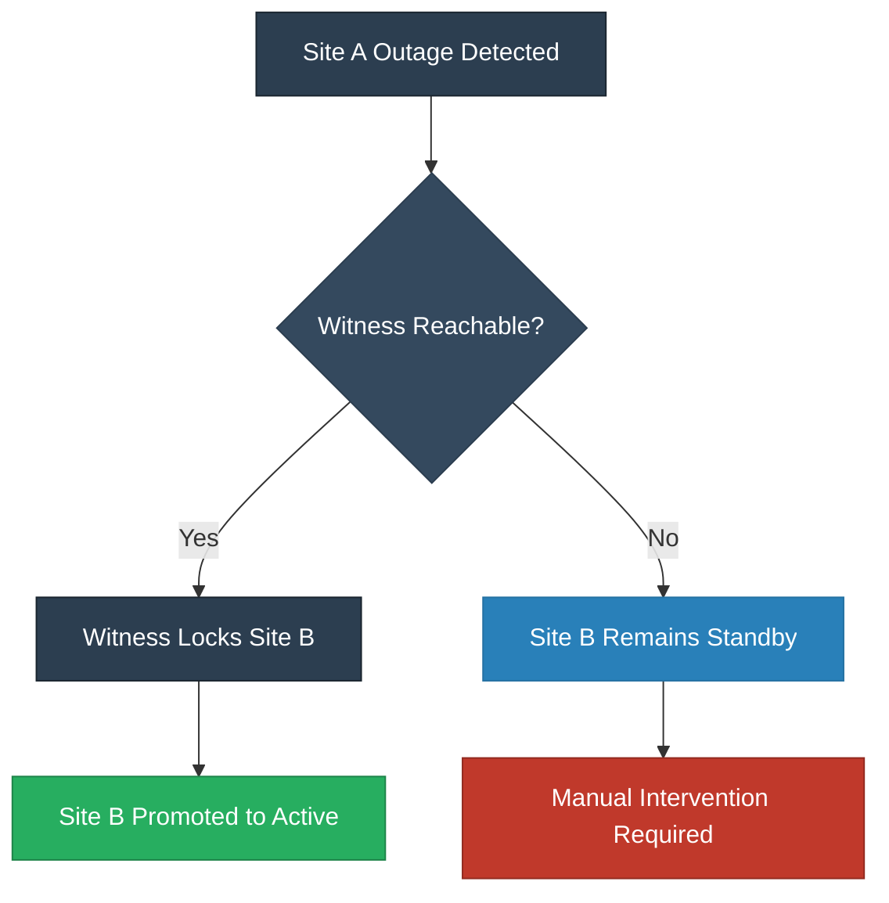

# Module 2: Metro Availability Overview

## 2.1 Synchronous Replication Fundamentals
The defining characteristic of Metro Availability is its use of synchronous replication. 

* **Zero RPO**: Every write operation is committed to both the local and remote clusters before being acknowledged to the application.
* **Replication Differences**: Unlike Asynchronous replication or NearSync, Metro provides real-time data mirroring.
* **Consistency Groups**: These ensure that related VMs, such as a database and its app server, are protected together to maintain write-order fidelity across sites.

## 2.2 The Role of the Witness
The Witness VM is a critical third-party component required for automated site failover and split-brain protection.

### Witness Arbitration Logic
The following diagram represents the decision-making process the cluster follows during a primary site outage:

### Understanding the Diagram
* **Quorum Lock**: When Site A fails, Site B attempts to acquire a lock on the Witness to prove it is the surviving site.
* **Promotion**: Once the lock is acquired, the standby container on Site B is promoted to Active, allowing VMs to restart.
* **Manual Intervention**: If the Witness is unreachable, Site B stays in standby to prevent a Split-Brain scenario.

## 2.3 Hypervisor and Software Support
Nutanix Metro Availability is designed to work across the industry's leading hypervisors with specific integration points for each.

* **Nutanix AHV**: Features native support for automated failover and simplified management directly through the Prism interface.
* **VMware ESXi**: Integrates with vCenter for datastore presentation and requires specific HA/DRS rules (Should/Must rules) to ensure operational stability and prevent I/O tromboning.
